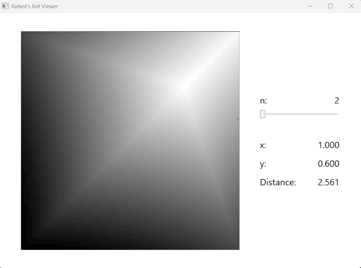

# Tools 2024
The project to create tools.

## Kotani's Ant Viewer
Visualizes Kotani's ant problem, for a cuboid of $1 \times 1 \times n$.  
cf. https://www.youtube.com/watch?v=W8Lo4SIgukI

## BFS DFS Viewer
Visualizes BFS (Queue), DFS (Stack), and DFS (Recursion).
